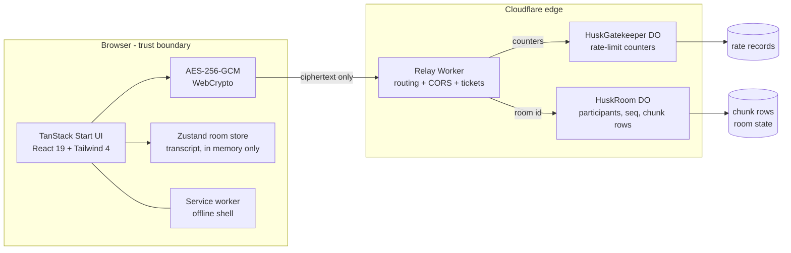
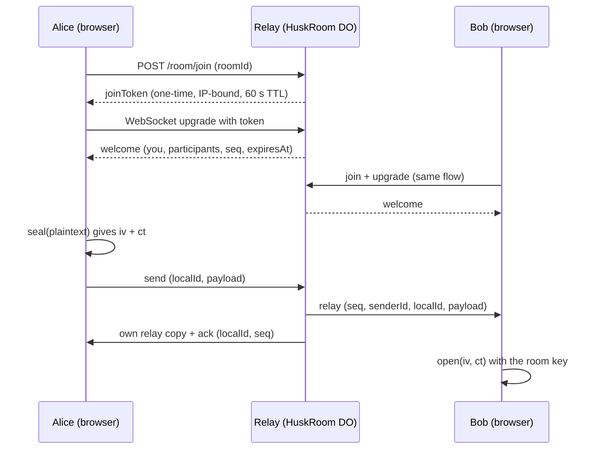
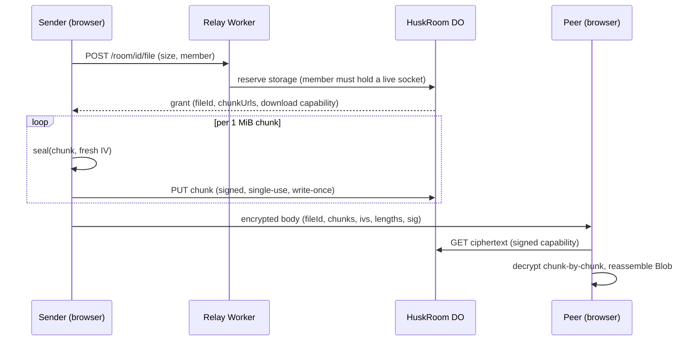
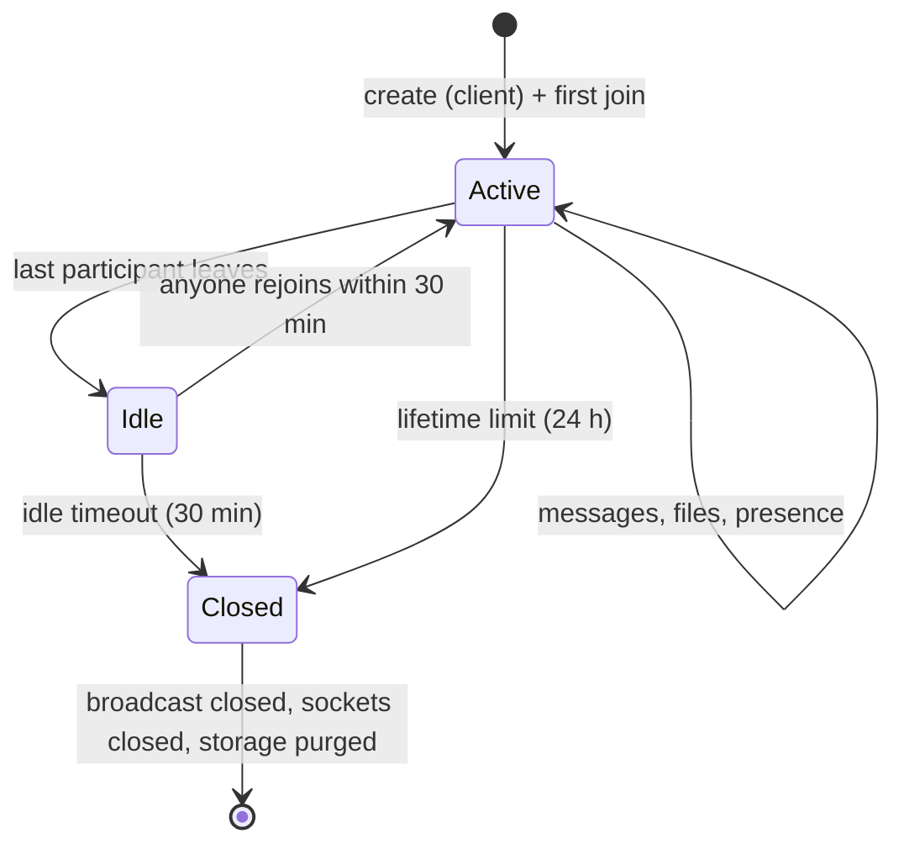

<div align="center">


# Husk

**Ephemeral, end-to-end encrypted rooms for chat and file transfer.**

The room key is generated in the browser and never leaves it. The relay sees
ciphertext, an IV and routing metadata — nothing else. When the room closes,
everything is gone.

[](LICENSE)
[](package.json)
[](package.json)
[](worker/wrangler.toml)
[](#testing)
[](public/sw.js)
[](package.json)

</div>

---

## Contents

- [What Husk is](#what-husk-is)
- [How the encryption works](#how-the-encryption-works)
- [Architecture](#architecture)
- [Message flow](#message-flow)
- [File transfer](#file-transfer)
- [Room lifecycle](#room-lifecycle)
- [Abuse controls](#abuse-controls)
- [Resilience](#resilience)
- [Security model](#security-model)
- [Project structure](#project-structure)
- [Development](#development)
- [Testing](#testing)
- [Deployment](#deployment)
- [Design system](#design-system)
- [License](#license)

## What Husk is

Husk is a web application for short-lived, private conversations. One person
creates a room and shares an invite link; whoever opens the link joins the same
room directly in the browser. Inside a room, participants can exchange text
messages and files. Nothing is persisted anywhere: there is no account, no
database, no message history and no user identity. Closing the tab discards the
local transcript; the relay purges every stored byte when the room closes.

| Property | Detail |
| --- | --- |
| End-to-end encryption | AES-256-GCM with a per-room 256-bit key, applied in the browser |
| Key handling | The key lives only in the URL fragment, which browsers never send to servers |
| Server trust | The relay is zero-knowledge: it cannot decrypt, moderate or replay content |
| Storage | Encrypted file chunks live inside the room's own Durable Object; no database, no bucket |
| Ephemerality | A server-side alarm closes the room and purges all storage; no manual cleanup |
| Identity | None. Participants are anonymous, per-tab identifiers |

## How the encryption works

1. When a room is created, the browser generates the room key: 32 random bytes
   (AES-256), encoded as URL-safe base64 and appended to the invite link:
   `/r/<roomId>#<key>`.
2. The URL fragment is never sent to any server by any browser, so the relay
   never receives the key. The relay routes messages by the 8-character room id
   alone.
3. Before a message leaves the tab, the plaintext body is serialized and sealed
   with AES-256-GCM using a fresh 96-bit random IV. The relay receives and
   broadcasts only `{ iv, ct }`.
4. Files are split into 1 MiB chunks; each chunk is sealed independently with
   its own IV and uploaded separately.
5. Decryption happens in the receiving browser. A frame that fails
   authentication is shown as *unverified* rather than silently dropped.

Room ids are 8 lowercase alphanumeric characters drawn from the WebCrypto CSPRNG
with rejection sampling, so every id is equally likely.

## Architecture

Husk is two deployables: a TanStack Start application (React 19, TypeScript,
Tailwind CSS 4) served as a Cloudflare Worker with static assets, and a
zero-knowledge relay Worker that owns two SQLite-backed Durable Objects.



Both Durable Objects use the SQLite storage backend. The room object holds the
participant list, the monotonic sequence counter, the persisted room lifecycle
state and one storage row per encrypted file chunk. The gatekeeper holds only
rate-limit counters and timestamps.

## Message flow

Every message gets a server-assigned, gap-free monotonic sequence number, so
ordering is decided by the relay and identical for every participant. The
sender's own bubble resolves from *sending* to *sent* on the ack; a resend of
the same `localId` is deduplicated server-side and re-acked with the original
sequence number.



Presence is broadcast on every join and leave. When the last peer leaves, a
grace window (8 s) covers a reconnecting peer before the transcript shows a
system note; the note carries a fractional sequence position so it stays exactly
where it happened in the conversation instead of sliding to the bottom.

## File transfer

Files never pass through the message relay. They are stored, encrypted, as
fixed-size rows inside the room's Durable Object, and move through
short-lived HMAC-signed URLs.



| Limit | Value |
| --- | --- |
| Chunk size | 1 MiB ciphertext (1 MiB plaintext + 16 B GCM tag) |
| Maximum file size | 25 MB |
| Live file budget per room | 100 MB (cancelled uploads refund the budget) |
| Upload ticket TTL | 300 s, single use per chunk row |
| Download capability | Signed, travels only inside the encrypted message body, expires with the room |

A cancelled or failed upload is cleaned up by a `cancel` frame that only the
reserving participant can issue for their own file; a chunk PUT that races a
cancel writes nothing.

## Room lifecycle

Closure is driven exclusively by a server-side alarm — a crashed host cannot
leave a room alive, and no client is trusted to clean up.



- The persisted room state (creation time, empty-since marker, sequence
  counter) survives isolate eviction and hibernation wakes.
- `alarm()` evaluates expiry once a minute; when it fires, every socket is
  closed, a `closed` frame is broadcast (reason `expired` or `idle`), and
  `storage.deleteAll()` purges the room state and every file chunk row.
- Clients map the close reason to an honest terminal screen; reconnecting to a
  purged room ends in a permanent *room unavailable* state.

## Abuse controls

All limits are enforced by the relay; counters live in the gatekeeper Durable
Object and contain no message data.

| Control | Budget |
| --- | --- |
| Joins (per IP, 5 min window) | 10 attempts, then escalating backoff: 60 s doubling to a 1 h ceiling |
| Room creation (per IP, 5 min window) | 5 attempts, separate key namespace, HTTP 429 with `retryAfter` |
| Join tokens | One-time, bound to the join caller's IP, 60 s TTL; a replayed token yields the same generic 404 as a nonexistent room |
| WebSocket without a valid token | Generic 404, identical to a nonexistent room (no existence oracle) |
| File reservation | Requires a currently connected participant id |
| Chunk upload | Signed, expiring, single-use; oversized or empty bodies rejected |
| Malformed frames | Answered with a `bad_request` error frame; the socket and the room stay healthy |

## Resilience

The client connection layer assumes the network is hostile:

- **Liveness detection** — a socket whose TCP peer vanished stays `OPEN`
  forever, so the client pings on an idle socket (20 s) and force-closes it if
  no server frame arrives within the pong window (10 s).
- **Bounded reconnect** — exponential backoff from 1 s to 15 s, a budget of 10
  attempts, a stability heuristic (a connection shorter than 10 s does not
  reset the budget) and a handshake-failure limit (3), so a purged room
  terminates cleanly instead of retrying forever.
- **Offline outbox** — up to 50 outbound frames are buffered while
  disconnected and flushed, in order, on reconnect.
- **Message states** — *sending* (spinner + 10 s ack timer), *sent*, *failed*
  (retryable), *unverified* (decryption failed).
- **PWA** — a service worker precaches the shell (cache-first for immutable
  assets, network-only for app routes) so the UI loads offline; conversation
  data is never cached.

## Security model

What the relay can see, and cannot do:

- It cannot decrypt anything: the room key never crosses the client boundary.
  This is verified across every call site; the worker contains no key material.
- It stores no message content, no history and no user identity. The
  gatekeeper's records hold counters and timestamps only.
- The ticket HMAC is compared in constant time and binds room id, file id and
  chunk index, so tickets cannot be forged or replayed across rooms.
- CORS is an allow-list, not a reflection; disallowed origins receive no
  `Access-Control-Allow-Origin` header at all.
- The join token travels in the query string because the browser WebSocket API
  cannot set custom handshake headers; the token is one-time, IP-bound and
  expires in 60 s, so the exposure window is a single upgrade.
- Rendered content is XSS-inert by construction: message text and file names
  are rendered as text, never as markup, and linkified URLs are restricted to
  safe schemes.

Threat-model note: Husk protects the *content* of a conversation from the
infrastructure. It does not authenticate humans — anyone holding the full
invite link (room id plus key fragment) can join, so the link must be shared
over a channel the participants already trust.

## Project structure

```
├── src/
│   ├── components/husk/     # chat, room info, primitives, icons, WebGL backdrop
│   ├── lib/husk/            # crypto, protocol, connection, store, room machine, files, api
│   ├── lib/                 # utils, error capture
│   ├── routes/              # landing page + /r/$roomId room screen
│   └── styles.css           # design-system tokens (Tailwind 4 theme)
├── worker/
│   ├── src/
│   │   ├── index.ts         # edge routing, CORS, ticketed file URLs, rate-limit gates
│   │   ├── room.ts          # HuskRoom Durable Object (relay + file storage + alarm)
│   │   ├── gate.ts          # HuskGatekeeper Durable Object (rate counters)
│   │   ├── rate-limit.ts    # window/backoff evaluation
│   │   ├── tickets.ts       # HMAC signing + constant-time verification
│   │   └── config.ts        # server-side constants (mirrors src/lib/husk/config.ts)
│   └── tests/               # workerd integration suite (real routes, real sockets)
├── live-tests/              # deployment battery: probe / drive / stress scripts
├── e2e/                     # Playwright accessibility + interaction specs
└── public/                  # PWA icons, fonts, service worker, _headers
```

## Development

Requirements: Node.js 24+ and pnpm (the only supported package manager).

```sh
pnpm install

# frontend (TanStack Start dev server, port 3000)
pnpm dev

# relay (wrangler dev for the Worker + Durable Objects)
cd worker
pnpm dev
```

Create `.env` in the repository root and point the frontend at the relay:

```
VITE_WORKER_URL=http://localhost:8787
```

For local development, add `http://localhost:3000` to `ALLOWED_ORIGINS` in
`worker/wrangler.toml`. The two config files (`src/lib/husk/config.ts` and
`worker/src/config.ts`) mirror each other; keep them in sync.

## Testing

```sh
pnpm test                # 121 unit tests (crypto, protocol, store, state machine, rate limit)
cd worker && pnpm test   # 26 integration tests through the real routes in workerd
pnpm exec tsc --noEmit   # typecheck, root
pnpm run lint            # eslint + prettier
pnpm run lint:anti-slop  # oxlint type-aware gate
pnpm run build           # production build (client + SSR + nitro cloudflare target)
```

The integration suite runs inside workerd via `@cloudflare/vitest-pool-workers`
and exercises the real routes: create and join, the socket upgrade, relay
ordering and dedup, presence, chunked upload and download with byte equality,
capacity limits, ticket forgery, token replay and rate limiting.

`live-tests/` contains the deployment battery used for release verification:
raw-socket probes (`probe-*.mjs`), browser-driven scenario runs (`drive-*.mjs`)
and stress scripts (`stress-*.mjs`). Joins are rate limited per IP, so scripts
that open many sockets space themselves across the join window.

## Deployment

One-time Cloudflare setup:

```sh
pnpm add -g wrangler
wrangler login

# ticket-signing secret for the file-transfer URLs
cd worker
pnpm wrangler secret put HUSK_TICKET_SECRET

# set ALLOWED_ORIGINS in worker/wrangler.toml to your frontend origins
```

Both deployables are Workers; no other resource is needed — the Durable Objects
create their own SQLite storage on deploy.

```sh
# relay
cd worker
pnpm run deploy

# frontend (nitro cloudflare-module output)
pnpm run build
wrangler deploy --config .output/server/wrangler.json
```

Set `VITE_WORKER_URL` (`.env.production`) to the deployed relay URL before the
frontend build so the client bakes in the right origin.

## Design system

All visual decisions come from a token system defined in `src/styles.css`;
Tailwind's default palette is never used in components.

| Token | Value | Usage |
| --- | --- | --- |
| `primary` | `#7de925` lime | interactive accent on both themes |
| `dark` | `#172112` near-black green | dark canvas, ink on accent |
| `surface` | `#f6faf4` green-tinted paper | light canvas |
| `accent` | `#3ce767` mint | brand mark on dark, success states |
| `highlight` | `#f2d8c4` peach | sparing warm highlight |

Typography is self-hosted Inter (variable, latin subset). Light and dark themes
swap tokens through a `dark` class; the brand mark ships in light, dark and
maskable variants under `public/icons/`.

## License

Released under the [MIT License](LICENSE).
